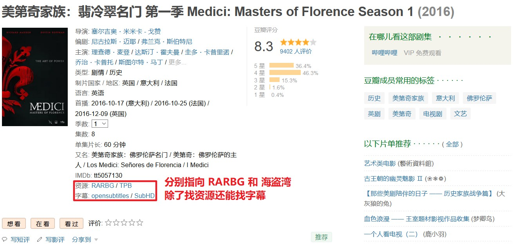

# Douban2RARBG

一个油猴脚本 (Userscript)。

为[豆瓣电影](https://douban.com/movie)添加两个找资源的链接，分别跳转到 [RARBG](https://rarbgmirror.com) 和 [TPB](https://thepiratebay.org)。

以及两个找字幕的链接，分别跳转到 [opensubtitles](https://www.opensubtitles.org/zh) 和 [SubHD](https://subhd.tv)。

## Depends

Depends on [Tampermonkey](https://www.tampermonkey.net/) or [Greasemonkey](https://www.greasespot.net/).

## Install

Click [here](https://cdn.jsdelivr.net/gh/mogeko/userscripts@master/release/douban2rarbg.user.js) to install.

View this UserScript in [Greasy Fork](https://greasyfork.org/zh-CN/scripts/427181-douban2rarbg).

## Screenshot

## License

The code in this project is released under the [MIT License](/LICENSE).
